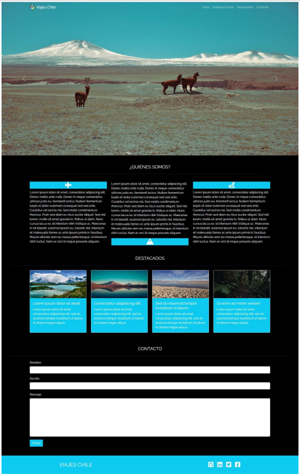

## Checklist VIAJES CHILE

Es el frontend de un sitio web que simula una agencia de viajes. Esta vez no hay maqueta, solo una imagen y tampoco el requerimiento de hacer un sitio móvil de este (es de implementación libre). Algunas consideraciones generales del desafio: 

- Tener navbar fija en tope de vista (OK), con logo y enlaces a las secciones de la página (OK), usando smooth scroll.(OK)
- Tener un carousel con las imágenes suministradas para ello.(OK)
- Tener una sección de presentación con favicons (literal, se refiere a íconos tipo Fontawesome) y 3 párrafos. (OK) Esta debe desaparecer en tamaños pequeños de pantalla. (OK)
- Tener una sección de destacados con 4 cards con la imagen e información asociada. (OK)
- Tener una sección de formulario de contacto. (OK)
- Tener un footer con links a las redes sociales. (OK)

## Requisitos evaluados: 
|Estado|Requisito|
|:-------:|:------:|
| OK |1. Construir página usando HTML. Etiquetas semánticas, organización de directorio y carga de archivos.|
| OK |2. Usar CSS: usar selectores de clase semánticamente relevantes. Google Fonts, Fontawesome. Documentado, indentado y ordenado|
| OK |3. Usar BS: integración del CDN, 3 componentes sin JS, uso de grilla y utilities. Documentar versión.|
| OK |4. BS componentes con JS: usar 2 o más componentes con JS (carousel, tooltips), codigo ordenado y documentado.|
| OK |5. Usar git-GitHub: git init y mínimo 5 commits. Implementar repo remoto en Github. Crear Github page del proyecto.|

* **Tipografía** 
  * Raleway
* **Colores:**
  * #000
  * #17a3b8 (tomado con pickcolor en Gimp)
* **Íconos:**
  * `<i class="fa-solid fa-plane"></i>`
  * `<i class="fa-solid fa-mountain"></i>`
  * `<i class="fa-solid fa-route"></i>`
  * `<i class="fa-brands fa-github-square"></i>`
  * `<i class="fa-brands fa-linkedin"></i>`
  * `<i class="fa-brands fa-twitter-square"></i>`
  * `<i class="fa-brands fa-facebook-square"></i>`

* Maqueta 

